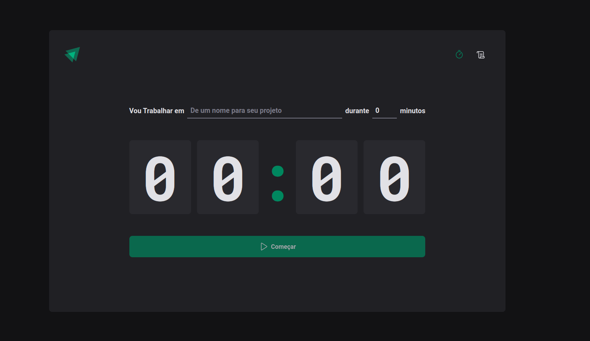
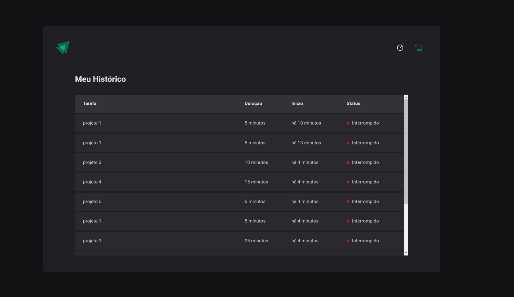

# Pomodoro Timer

<h1 align="center" >
    
    
</h1>

  <a href="#-tecnologias">Tecnologias</a>&nbsp;&nbsp;&nbsp;|&nbsp;&nbsp;&nbsp;
  <a href="#-projeto">Projeto</a>&nbsp;&nbsp;&nbsp;|&nbsp;&nbsp;&nbsp;
  <a href="#-layout">Layout</a>&nbsp;&nbsp;&nbsp;|&nbsp;&nbsp;&nbsp;
  <a href="#memo-licença">Licença</a>

  

 

## 🚀 Tecnologias

Esse projeto foi desenvolvido com as seguintes tecnologias:

- [Vite](https://vitejs.dev/)
- [React](https://reactjs.org)
- [TypeScript](https://www.typescriptlang.org/)
- [Phosphor Icons](https://phosphoricons.com/)
- [React Hook Form](https://react-hook-form.com/)
- [React Router](https://reactrouter.com/en/main)
- [styled-components](https://styled-components.com/)

## 💻 Projeto

Projeto criado na Especialização React Js - modulo 2 - trilha 2022 da Rocketseat,aplicação para organização de tarefas cronometradas
Para rodar clone o repositório  `git clone https://github.com/DouglasO-R/pomodoro.git`, acesse a pasta do timer `cd pomodoro`, instale as dependências `yarn`, e rode o app com `yarn dev` 

## 🔖 Layout

Nos links abaixo você encontra o layout do projeto web e também do mobile. Lembrando que você precisa ter uma conta no [Figma](http://figma.com/) para acessá-lo.

- [Layout Web](https://www.figma.com/community/file/1127351821076435124)

## :memo: Licença

Esse projeto está sob a licença MIT.
